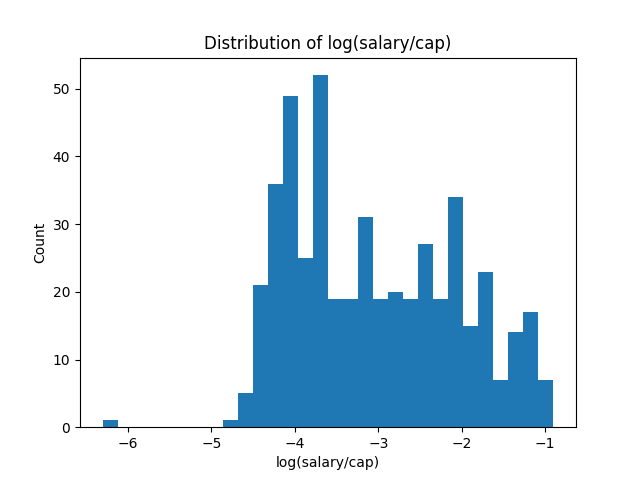

# NBA Player Salary Analysis 📊

## Objective
Analyze NBA player performance data to identify key factors influencing player salaries.

## Dataset
- NBA player statistics
- Salary cap data

## Tech Stack
- Python (Pandas, NumPy, Matplotlib)

## Key Insights
- Win Shares and Minutes Played strongly influence player salaries
- Salary normalized using salary cap for fair comparison

## Results

### Salary Distribution


## How to Run
```bash
pip install pandas numpy matplotlib openpyxl
python nba_salary_analysis.py
